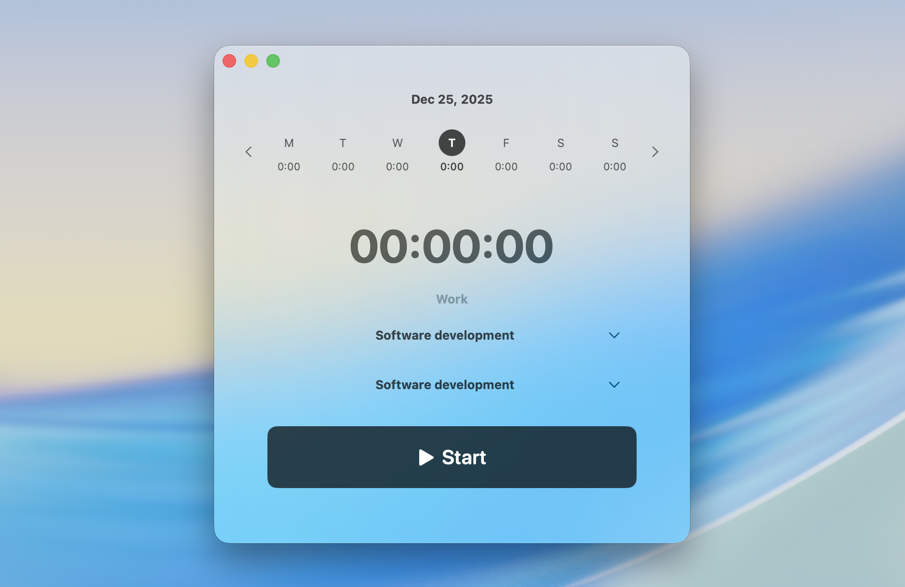

# Liquid Harvest

Liquid Harvest is a native macOS app for tracking time in [Harvest](https://www.getharvest.com/). It runs in the menu bar and includes a full window UI for starting/stopping timers and editing today’s entries.

## Features

- Menu bar timer with quick stop
- Start/stop timers and edit notes
- Today view + week navigation
- OAuth login (PKCE) with a local callback server

## Setup (required)

Because this is an open-source app, **you must provide your own Harvest OAuth2 Client ID and Client Secret**.

- Create an OAuth2 application at [Harvest Developer Tools](https://id.getharvest.com/developers)
- Set the Redirect URI to:
  - `http://localhost:5006/callback`
- Run the app; the first screen (“Setup”) will prompt you to enter:
  - Client ID
  - Client Secret

## Build & run

- Open `Liquid Harvest.xcodeproj` in Xcode
- Select the `Liquid Harvest` scheme
- Run

Note: the Xcode project currently has `MACOSX_DEPLOYMENT_TARGET = 26.1`. If your macOS/Xcode toolchain doesn’t support that target, lower it in the project settings.

## Security & privacy notes

- Your Harvest **Client Secret** is stored in the macOS **Keychain** (via `KeychainManager`).
- OAuth tokens are stored in the macOS **Keychain**.
- The app calls the Harvest API over HTTPS; it does not run any external servers.

## License

MIT. See `LICENSE`.

## Disclaimer

Liquid Harvest is not affiliated with Harvest.

